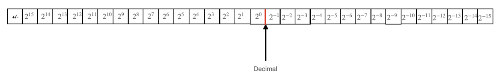

# Fixed-Point Arithmetic


## 참고자료
https://vanhunteradams.com/FixedPoint/FixedPoint.html#Addition/subtraction
  
  
## signed int

int는 32비트다. 
int는 부호가 있는 정수형이고 2의 보수법에 따라 음수가 표현된다.  
2의 보수법을 따르면, 맨 앞의 비트는 부호에 대한 정보를 담게 된다.  
남은 31개의 비트에는 값을 저장할 수 있으므로 $+/-2^{31}$ 범위 내의 값을 저장할 수 있다.  
최저 비트는 $2^0$ 을, 그 다음은 $2^1$, ... 두 번째로 최상위인 비트는 $2^{30}$ 을 표현한다.  
이때 int는 최저 비트의 뒤에 소수점이 있다고 생각할 수 있다.  
왜냐하면 int의 resolution은 $2^0$, 즉 1이기 때문에 int로는 정수값만 표현할 수 있기 때문이다.  
  
  
## fixed point
fixed point number를 만들기 위해서, 일단 소수점을 중간 어딘가에 위치시켜야한다.  
예를 들어서, 14번째 비트와 15비트 사이에 소수점이 있다고 가정해보자.  
CPU는 차이를 모르지만 우리는 주로 이러한 방식으로 수를 생각하곤 한다.  
하지만 CPU도 이 수를 적절하게 잘 다룰 수 있도록 고려해야하는 특별한 경우들이 있다.  



먼저 아까의 가정에 의해서 우리가 표현할 수 있는 수의 범위가 $+/-2^{16}$ 로 축소되었지만, 저장ㅇ할 수 있는 값의 resolution은 $2^-{15}$ 로 낮아졌다.  
이를 range for resolution에 대한 trade-off가 이뤄졌다고 할 수 있다.  

CPU는 여전히 signed int로 이 수를 바라본다.  
그러므로 fix라고 부르는 데이터 타입을 다음과 같이 정의할 수 있다.  

```c
typedef signed int fix
```
  
  
## fixed point 연산


### 덧셈/뺄셈
덧셈과 뺄셈은 그냥 된다.  
CPU는 2의 보수 하드웨어 덧셈기가 있으며, 비트 문자열 어디에 소수점을 위치하든 덧셈과 뺄셈은 항상 동일하게 작동한다.  
따라서 다음과 같은 형식은 완전히 허용된다.

```c
fix var1 = int2fix(50);
fix var2 = int2fix(30);

fix var3 = var1 + var2;
```